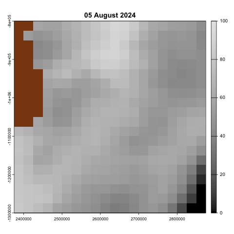

# icebreaker

<!-- badges: start -->
<!-- badges: end -->

The goal of icebreaker is to practice using geotargets to answer questions and use real data.

In this case, thanks to the gracrious assstance of [@mdsumner](https://github.com/mdsumner/), we explore how sea ice near [Casey Station](https://en.wikipedia.org/wiki/Casey_Station) in Antarctica changes over time.

We used [geotargets](https://github.com/njtierney/geotargets) and [dynamic branching](http://geotargets.njtierney.com/articles/tar_terra_tiles.html) to cleverly read in many rasters and not overload local memory.

As a first exploration, we produced this gif:

